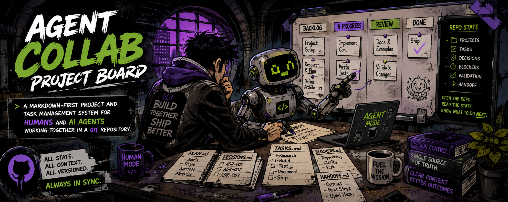

# Agent Collab Project Board




A Markdown-first project and task management system designed for **humans and AI agents working together inside a Git repository**.

Projects, tasks, portfolio state, decisions, blockers, validation, and handoff context remain version-controlled alongside the work itself.

The goal is simple:

> A new human or agent should be able to open the repository, read its state, and safely determine what to do next.

---

## System Overview

The repository uses three operational state layers:

```text
BOARD.md
   ↓
projects/<project-slug>.md
   ↓
tasks/<project-slug>-tasks.md
   ↓
repository work
```

Each layer has one job.

| Layer | Purpose |
| --- | --- |
| `BOARD.md` | Portfolio overview, priority, focus, and cross-project coordination |
| `/projects` | Durable project definition and project-level state |
| `/tasks` | Detailed executable work and Kanban task state |
| Repository files | Actual implementation, documentation, research, and deliverables |

After work occurs, state flows upward:

```text
repository work
      ↓
task board
      ↓
project file if project state changed
      ↓
BOARD.md if portfolio state changed
```

Higher layers summarize lower layers rather than duplicating them.

---

## Agent-First Architecture

The canonical repository agent entrypoint is:

[`AGENTS.md`](./AGENTS.md)

Scoped instructions live alongside the state they govern:

```text
AGENTS.md
   │
   ├── projects/AGENTS.md
   └── tasks/AGENTS.md
```

This allows modern coding agents that support `AGENTS.md` discovery and directory scoping to receive concise instructions appropriate to the files they are working with.

Detailed policies remain separate:

```text
docs/INSTRUCTIONS.md
projects/INSTRUCTIONS.md
tasks/INSTRUCTIONS.md
```

The intent is:

```text
AGENTS.md
→ concise operational rules

INSTRUCTIONS.md
→ detailed policy

README.md
→ human orientation
```

---

## Repository Structure

```text
.
├── README.md
├── AGENTS.md
├── BOARD.md
├── CLAUDE.md
├── GEMNI.md
│
├── docs/
│   ├── README.md
│   ├── HOWTO.md
│   └── INSTRUCTIONS.md
│
├── projects/
│   ├── README.md
│   ├── AGENTS.md
│   ├── INSTRUCTIONS.md
│   ├── _TEMPLATE.md
│   └── <project-slug>.md
│
├── tasks/
│   ├── README.md
│   ├── AGENTS.md
│   ├── INSTRUCTIONS.md
│   ├── _TEMPLATE.md
│   └── <project-slug>-tasks.md
│
├── ui/            → local dashboard (server + frontend)
├── sdk/           → agent-board SDK (read/apply/validate/watch)
├── skills/        → agent skills bundle (board-state, board-edit, ...)
└── platform/      → install shims for Cursor, Codex, VS Code
```

---

## Live Dashboard

The same repository can be viewed as a local dashboard in a browser.

It renders the board as columns, opens project cards and their task boards, and refreshes on its own whenever the Markdown changes.

The dashboard reads and writes through the shared `agent-board` SDK (`sdk/`); the Markdown files remain the source of truth.

Run it with a single command from the `ui/` directory:

```text
node server.js
```

Then open the printed local address. Keep `BOARD.md`, `projects/`, and `tasks/` in mind: editing any of them updates the open page automatically.

---

## SDK

The board's programmatic interface is the zero-dependency `agent-board` package in [`sdk/`](./sdk/):

```js
const { createBoard } = require('agent-board');
const board = createBoard(repo);
board.read(); board.apply(target, ops); board.validate(target, ops); board.watch(cb); board.ops();
```

The dashboard server and the agent CLI both run on it. See [`sdk/README.md`](./sdk/README.md).

---

## Core Files

### `BOARD.md`

[`BOARD.md`](./BOARD.md) is the live repository-wide portfolio dashboard.

It answers:

```text
What projects exist?
What is active?
What has priority?
What is blocked?
What requires review?
What recently completed?
What is the current focus?
What happens next?
```

Detailed project and task state should not be copied into the board.

---

### `AGENTS.md`

[`AGENTS.md`](./AGENTS.md) is the canonical repository-wide agent instruction file.

Agents should use it to understand:

- repository state ownership;
- required read order;
- task-selection rules;
- completion requirements;
- synchronization;
- handoff expectations.

More-specific instructions exist under:

[`projects/AGENTS.md`](./projects/AGENTS.md)

and:

[`tasks/AGENTS.md`](./tasks/AGENTS.md)

---

### `/docs`

System-level documentation lives under:

[`docs/`](./docs/)

Key files:

- [`docs/HOWTO.md`](./docs/HOWTO.md) — practical user guide for working with agents;
- [`docs/INSTRUCTIONS.md`](./docs/INSTRUCTIONS.md) — full repository operating policy;
- [`docs/README.md`](./docs/README.md) — documentation index.

---

## Projects

Project records live in:

```text
projects/
```

Each project gets one canonical file:

```text
projects/<project-slug>.md
```

Example:

```text
projects/authentication-refresh.md
```

Project files own:

- objective;
- success criteria;
- scope;
- requirements;
- deliverables;
- milestones;
- project dependencies;
- constraints;
- risks;
- project decisions;
- current project state;
- project-level next action.

Detailed execution belongs in `/tasks`.

Project overview:

[`projects/README.md`](./projects/README.md)

Agent instructions:

[`projects/AGENTS.md`](./projects/AGENTS.md)

Full project policy:

[`projects/INSTRUCTIONS.md`](./projects/INSTRUCTIONS.md)

Template:

[`projects/_TEMPLATE.md`](./projects/_TEMPLATE.md)

---

## Tasks

Executable work lives in:

```text
tasks/
```

Each project gets one matching task board:

```text
tasks/<project-slug>-tasks.md
```

Example:

```text
tasks/authentication-refresh-tasks.md
```

Task boards own:

- task IDs;
- goals;
- Kanban state;
- priorities;
- task types;
- acceptance criteria;
- dependencies;
- blockers;
- validation;
- implementation notes;
- task decisions;
- next actions;
- task history.

Task overview:

[`tasks/README.md`](./tasks/README.md)

Agent instructions:

[`tasks/AGENTS.md`](./tasks/AGENTS.md)

Full task policy:

[`tasks/INSTRUCTIONS.md`](./tasks/INSTRUCTIONS.md)

Template:

[`tasks/_TEMPLATE.md`](./tasks/_TEMPLATE.md)

---

## Project and Task Pairing

Project and task files share a stable slug.

```text
projects/authentication-refresh.md
tasks/authentication-refresh-tasks.md
```

Another example:

```text
projects/dashboard-redesign.md
tasks/dashboard-redesign-tasks.md
```

This relationship should remain predictable.

Project files link to their task boards.

Task boards link back to their projects.

`BOARD.md` links to both.

---

## Canonical State

Each type of state has one authoritative location.

| Information | Canonical Location |
| --- | --- |
| Portfolio overview | `BOARD.md` |
| Current portfolio focus | `BOARD.md` |
| Cross-project priority | `BOARD.md` |
| Cross-project blockers | `BOARD.md` |
| Cross-project dependencies | `BOARD.md` |
| Project objective | `/projects/<project>.md` |
| Project success criteria | `/projects/<project>.md` |
| Project scope | `/projects/<project>.md` |
| Project requirements | `/projects/<project>.md` |
| Project milestones | `/projects/<project>.md` |
| Project risks | `/projects/<project>.md` |
| Project decisions | `/projects/<project>.md` |
| Individual tasks | `/tasks/<project>-tasks.md` |
| Task status | `/tasks/<project>-tasks.md` |
| Acceptance criteria | `/tasks/<project>-tasks.md` |
| Task blockers | `/tasks/<project>-tasks.md` |
| Task dependencies | `/tasks/<project>-tasks.md` |
| Task validation | `/tasks/<project>-tasks.md` |

The governing rule is:

> **Store information at the lowest appropriate canonical level. Summarize upward without duplicating detailed state.**

---

## Project Lifecycle

Projects use:

```text
Planning
   ↓
Ready
   ↓
Active
   ↓
Review
   ↓
Complete
```

Additional states:

```text
Blocked
Paused
Archived
```

A project appears in exactly one primary state section of `BOARD.md`.

Project completion is governed by its project-level success criteria.

---

## Task Workflow

Tasks use:

```text
Backlog
   ↓
Ready
   ↓
In Progress
   ↓
Review
   ↓
Done
```

Temporarily blocked work moves to:

```text
Blocked
```

A task exists in exactly one workflow section.

A task is `Done` only when its acceptance criteria and required validation are satisfied.

---

## Quick Start

### 1. Read the Board

Open:

[`BOARD.md`](./BOARD.md)

This provides the current repository-level state.

### 2. Create a Project

Copy:

```text
projects/_TEMPLATE.md
```

to:

```text
projects/my-project.md
```

### 3. Create Its Task Board

Copy:

```text
tasks/_TEMPLATE.md
```

to:

```text
tasks/my-project-tasks.md
```

### 4. Link Them

Project:

```markdown
[Board](../BOARD.md) · [Tasks](../tasks/my-project-tasks.md)
```

Tasks:

```markdown
[Board](../BOARD.md) · [Project](../projects/my-project.md)
```

### 5. Add the Project to `BOARD.md`

Place its project card in the appropriate project-state section.

### 6. Give an Agent the Repository

A useful prompt is:

```text
Read AGENTS.md and BOARD.md first.

Identify the current project and follow its project and task files.

Perform the requested work, validate it, and synchronize canonical repository state before finishing.
```

See [`docs/HOWTO.md`](./docs/HOWTO.md) for complete examples.

---

## Modern Agent Compatibility

`AGENTS.md` is the canonical repository instruction format.

Additional lightweight compatibility files may exist for tools with their own automatic context conventions:

```text
CLAUDE.md
GEMNI.md
```

These should point agents back toward the canonical repository system rather than maintain separate project-management policies.

The architecture should remain:

```text
Tool-specific adapter
        ↓
AGENTS.md
        ↓
Scoped AGENTS.md
        ↓
Canonical state
```

Avoid maintaining multiple independent copies of the same operating rules.

---

## Task IDs

Tasks should use stable project-specific prefixes.

Example:

```text
AUTH-001
AUTH-002
AUTH-003
```

Other examples:

```text
API-001
DOCS-001
DASH-001
```

IDs should never be reused.

Gaps are acceptable.

Stable references matter more than contiguous numbering.

---

## Decisions

Task decisions use:

```text
TDEC-001
```

and remain in the task board.

Project decisions use:

```text
DEC-001
```

and remain in the project file.

Meaningful decisions are preserved even when superseded.

---

## Completion

### Task Completion

A task is complete only when:

- its goal has been achieved;
- required acceptance criteria are satisfied;
- required validation has been performed;
- no unresolved blocker prevents completion.

### Project Completion

A project is complete only when:

- project success criteria are satisfied;
- required deliverables exist;
- relevant milestones are complete;
- required review or validation has finished;
- no unresolved project blocker prevents completion.

Task count alone does not determine project completion.

---

## Blockers

Store blockers at the level they affect.

```text
Task blocker
→ task board

Project blocker
→ project file

Cross-project blocker
→ BOARD.md
```

Higher-level files may summarize lower-level blockers when they materially affect the broader view.

---

## Agent Workflow

A normal agent session follows:

```text
AGENTS.md
   ↓
BOARD.md
   ↓
project file
   ↓
task board
   ↓
repository work
   ↓
task state update
   ↓
project update if needed
   ↓
BOARD update if needed
```

Another agent should be able to resume from those files without previous conversation history.

---

## Design Principles

### Markdown First

Operational state remains understandable as plain text.

### Git Native

Project-management changes are version-controlled with the repository.

### Agent Forward

Structure is predictable enough for agents to safely inspect and modify.

### Human Readable

The same state remains easy to browse on GitHub.

### Canonical

Each kind of state has one preferred source of truth.

### Layered

Portfolio, project, task, and implementation concerns remain separate.

### Verifiable

Completion depends on evidence rather than attempted effort.

### Resumable

Repository files preserve the handoff between humans, sessions, and agents.

### Minimal Duplication

Higher levels summarize rather than copy detailed lower-level state.

---

## Documentation

### Users

Read:

[`docs/HOWTO.md`](./docs/HOWTO.md)

### Agents

Read:

[`AGENTS.md`](./AGENTS.md)

### Full Repository Policy

Read:

[`docs/INSTRUCTIONS.md`](./docs/INSTRUCTIONS.md)

### Projects

Read:

[`projects/README.md`](./projects/README.md)

### Tasks

Read:

[`tasks/README.md`](./tasks/README.md)

---

## Mental Model

```text
┌─────────────────────────────────────────┐
│                BOARD.md                 │
│                                         │
│ Portfolio • Priority • Focus • Blocks  │
└───────────────────┬─────────────────────┘
                    ↓
┌─────────────────────────────────────────┐
│       projects/<project-slug>.md        │
│                                         │
│ Goal • Scope • Requirements • Success  │
│ Milestones • Risks • Decisions • State │
└───────────────────┬─────────────────────┘
                    ↓
┌─────────────────────────────────────────┐
│     tasks/<project-slug>-tasks.md       │
│                                         │
│ Tasks • Kanban • Criteria • Validation │
│ Dependencies • Blockers • Next Actions │
└───────────────────┬─────────────────────┘
                    ↓
┌─────────────────────────────────────────┐
│             Repository Work             │
│                                         │
│ Code • Docs • Research • Deliverables  │
└─────────────────────────────────────────┘
```

---

## Final Principle

The board should answer:

> What matters right now?

The project file should answer:

> What are we trying to accomplish?

The task board should answer:

> What work moves us forward?

The repository should answer:

> What actually exists?

Keep those answers synchronized.